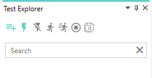
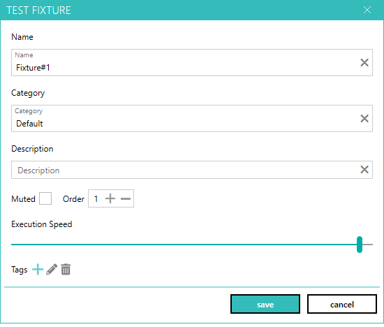
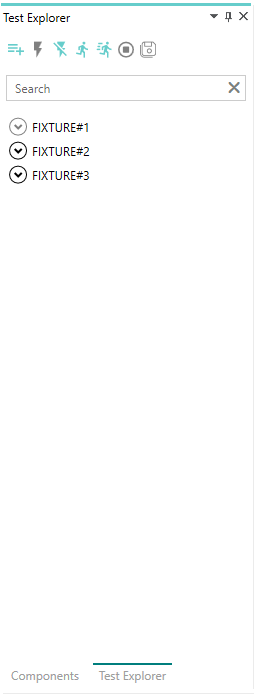

--- 
title: "Add fixtures"
linkTitle: "5. Add fixtures"
weight: 5
description: >
  Add few fixtures to the automation process
---

In this tutorial, we will add few fixtures to the automation process.

1. Activate the "Test Explorer" pane.
2. Click on "Add new fixture" icon button on the toolbar

    

3. This will open the new popup dialog to add new test fixture.

    

4. Leave the default values and click on save button to create fixture.
5. Repeat the process twice to create two more fixture with default value.
6. At this step, you should have three fixtures and your screen should look as shown below.

    