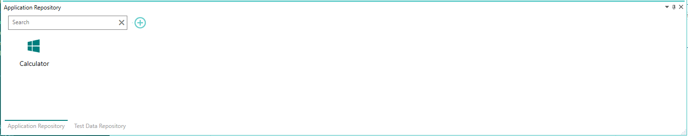
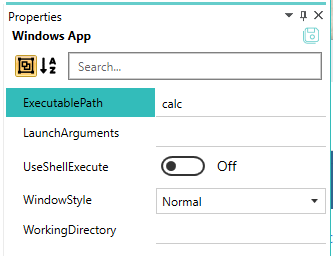

--- 
title: "Add new application"
linkTitle: "1. Add new application"
weight: 1
description: >
  Add and configure new application for which we need to create automation test cases in pixel-designer
---

In this tutorial, we will add and configure "calculator" application that come with the windows. Launch the pixel-designer and let's get started.

1. Click the Add (+) button in the "Applications Repository" pane at the bottom.
2. Click "Windows App" from the popup menu.
3. An application icon appears with name "1".
4. Select this application icon, right click -> rename. Rename apaplication to "Calculator" and press enter. The new name should start showing up now as shown below.
  
5. Select this application icon again, right click - > Edit.
6. Application details are in edit mode in property grid pane on right side. 
7. Set the value of "ExecutablePath" to "calc" and click on save icon on top right of property grid pane.
  

> Some tutorials toward the end require that pixel-persistence service is up and running and pixel-designer is running in online mode. You can continue in offline mode for the most part if you want to quickly get a feel of pixel-designer without investing time in all necessary setup.
