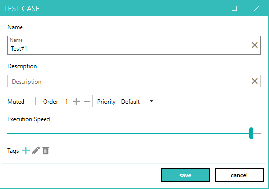
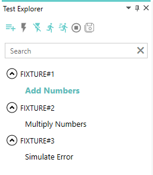
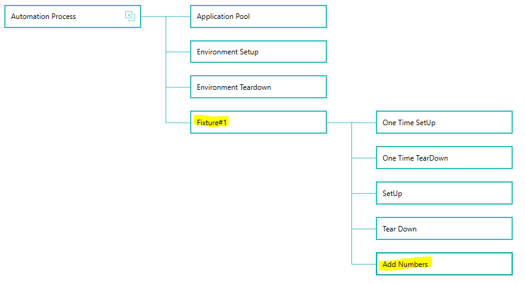
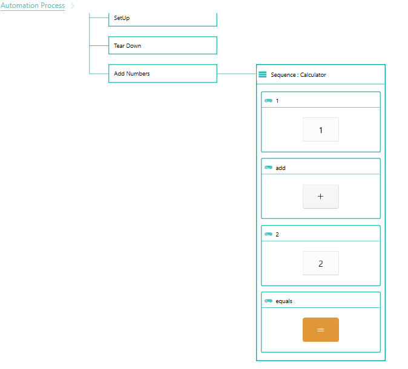
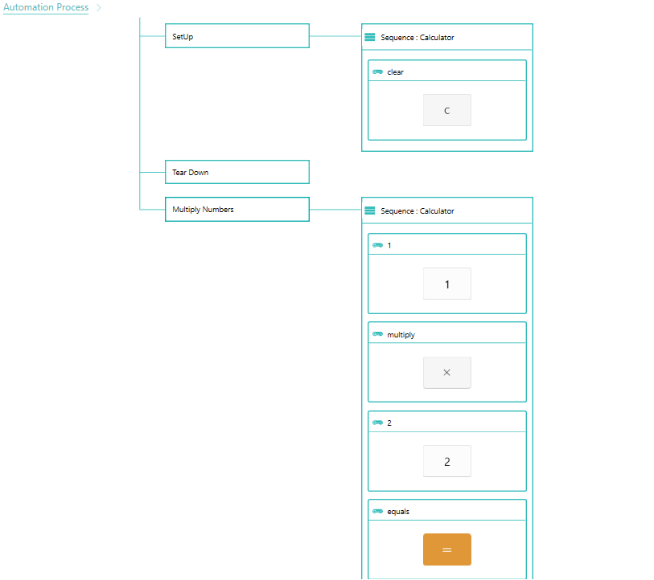
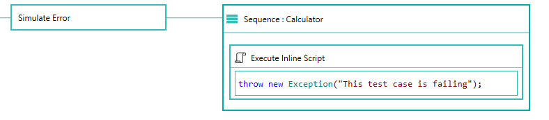

--- 
title: "Add test cases"
linkTitle: "6. Add test cases"
weight: 6
description: >
  Add few test cases to the automation process
---

In this tutorial, we will add a test case to each fixture we created earlier.

## Creating new test cases

1. Activate the "Test Explorer" pane.
2. Right click "Fixture#1" and select "Add Test".
3. This will open popup window to add a new test case.

    

4. Change the name to "Add Numbers" and click save.
5. Similarly, add a new test case named "Multiply Numbers" to Fixture#2 and "Simulate Error" to Fixture#3.
6. Activate the "Test Data Repository" pane at the bottom and drag drop "EmptyDataSource" on each test case.
    > Test cases require that a data source should be assigned to them before they become active and can be worked with. Your test case will execute once for each data record returned by the data source. Test data source can be coded or mapped to csv files. EmptyDataSource returns only one data record and can be used with any test case that doesn't depend on any data. It is created by default for each new automation project. It is also posssible to override the data source at runtime using prefixes to run your test cases with different sets of data dynamically.
8. After above steps, your screen should look as shown below.

    

## Configure steps for test case "Fixture#1 -> Add Numbers"

1. Right click test case "Add Numbers" and click open.
2. Test case "Add Numbers" should be open on designer canvas now.

    

3. Drag drop the calculator application from application explorer on to "Add Numbers" component.
4. Drag drop controls 1, add, 2 and equals from Control explorer to the "Sequence : Calculator" component added in previous step.
5. After above steps, your screen should look as shown below.

    

6. Drag drop component "UIA -> Invoke" from component pane to controls 1, 2, add and equals.

7. Right click "Add Numbers" test case in test explorer  and click "Save" or click save all icon on test explorer toolbar.
8. Ensure Calculator application is not alredy running.
9. Setup environment from the test explorer.
10. Select the test case "Add Numbers" and then click "Run Selected" button from the test explorer toolbar to execute the test case.
11. Tear down environment to close the calculator application.

## Configure steps for test case "Fixture#2 -> Multiply Numbers"

1. Right click test case "Multiply Numbers" and click open.
2. Test case "Multiply Numbers" should be open on designer canvas now.
3. Drag drop the calculator application from application explorer on to "Setup" component
4. Drag drop control clear from control explorer to the to the "Sequence : Calculator" component added in previous step and add "UIA -> Invoke" component to clear control component. This is required to clear the results from previous test case before executing the test case.
5. Drag drop the calculator application from application explorer on to "Multiply Numbers" component
6. Drag drop controls 1, multiply, 2 and equals from Control explorer to the "Sequence : Calculator" component added in previous step .
7. Instead of "UIA -> Invoke" component which automates the control using API, we will simulate mouse click using "Input Device -> Mouse -> Click" component.
Add "Input Device -> Mouse -> Click" component to all the controls.
    > Simulation using mouse and keyboard requiress application to have focus. We can ensure that by setting "Requires Focus" property to true on the application sequence component added to test case.
8. Right click "Multiply Numbers" test case in test explorer  and click "Save" or click save all icon on test explorer toolbar.
9. After above steps, your screen should look as shown below.

    

9. Ensure Calculator application is not alredy running.
10. Setup environment from the test explorer.
11. Select the test case "Multiply Numbers" and then click "Run Selected" button from the test explorer toolbar to execute the test case.
12. Tear down environment to close the calculator application.

## Configure steps for test case "Fixture#3 -> Simulate error"

1. Right click test case "Simulate error" and click open.
2. Drag drop the calculator application from application explorer on to "Simulate Error" component.
3. Add "Scripting -> Script [Inline]" component to the application sequence.
4. Set the content as shown below 

    

5. Right click "Simulate error" test case in test explorer  and click "Save" or click save all icon on test explorer toolbar.
6. Ensure Calculator application is not alredy running.
7. Setup environment from the test explorer.
8. Select the test case "Simulate error" and then click "Run Selected" button from the test explorer toolbar to execute the test case.
9. Execution of test case will fail.
10. Tear down environment to close the calculator application.

## Run all the test cases simultaneously

1. Ensure Calculator application is not alredy running.
2. Setup environment from the test explorer.
3. Click "Run All" from the test explorer.
4. Tear down environment once all test cases are executed.