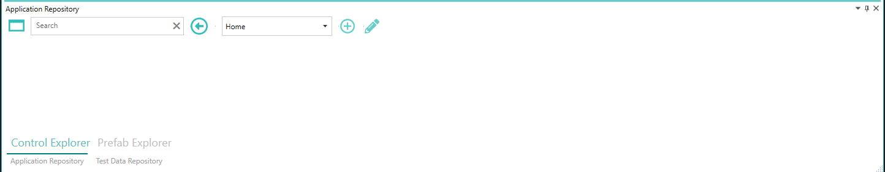
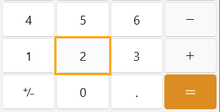
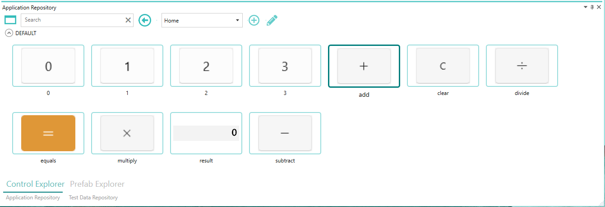

--- 
title: "Capture controls"
linkTitle: "2. Capture controls"
weight: 2
description: >
  Capture and configure controls to automate for the calculator application in pixel-designer
---

In this tutorial, we will capture and configure the controls belonging to calculator application that need to be automated in pixel-designer

1. Double click the "Calculator" application icon to activate "Control Explorer" inside the Application repoitory.

    

2. Launch calculator application by hitting win+r and then type calc followed by enter.
3. In pixel-designer, click Screen Scrappers -> UIA Scrapper from top level menu. At this point, if you hover over any control on applications that support [UIA](https://learn.microsoft.com/en-us/dotnet/framework/ui-automation/), they will get highlighted with an orange rectangle as shown below.
 
    

4. Hold left ctrl and click any of the buttons on calculator to capture it. If successfully capture, highlight rectangle will turn green.
5. Let's capture button 0, 1, 2, 3, add, subtract, multiply, divide, equals, clear and result. 
6. Once all controls are captured, you can go back to Screen scrappers -> UIA Scrapper and click it again to exit capture mode.
7. All the captured controls will appear in control explorer view now. You can now rename these controls by selecting them and right click -> rename or you can inspect and modify captured details by right click -> Configure.
8. Control explorer should look as shown below at this point assuming you have also renamed the controls.

    
