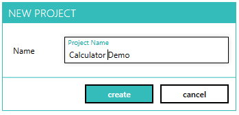

--- 
title: "Create new project"
linkTitle: "3. Create new project"
weight: 3
description: >
  Create a new automation project for holding test cases for calculator
---

In this tutorial, we will create a new automation project. Automation project can contain test fixtures and test cases for our application.

1. Click on the Add (+) icon left of "Projects" on the Home tab.
2. This will open the dialog to create new automation project.
3. Set the name as "Calculator Demo" and click "Create".
    
    

4. The project will be created and opened now in designer in a new tab.