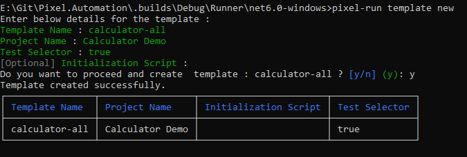
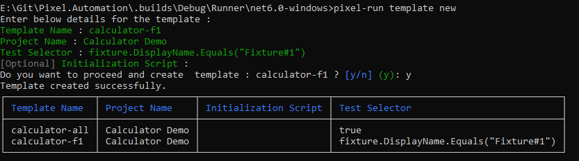
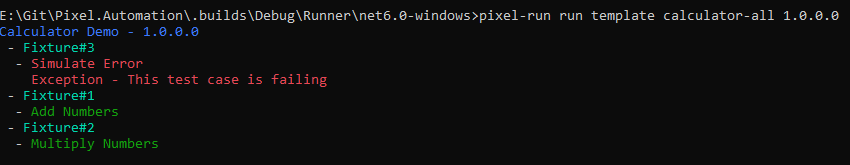
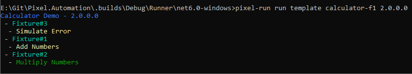

--- 
title: "Execute test cases"
linkTitle: "8. Execute test cases"
weight: 8
description: >
  Create templates in pixel-runner and use them to execute your test cases.
---

> This tutorial requires that all the previous steps in pixel-designer were done in online mode.

In this tutorial, we will create templates in pixel-runner and use these templates to execute test cases in pixel-runner.
Templates capture the details of which test cases should be executed for a given version of automation project.

## Creating templates in pixel-runner

1. Launch command prompt and change directory to where pixel-run.exe is located. See setup guide for pixel-runner if required.

2. Run  `pixel-run template --help` to see help for templates
3. Run  `pixel-run template new` to create a new template and follow instructions to provide required value. This template will execute all test cases

    

4. Repeat step 3 to create another template as shown below. This template will execute only test cases belonging to Fixture#1 for project "Calculator Demo"

    

> Test selectors are C# scripts which can be used to filter if a test case belonging to a given fixture can be executed.

## Executing test cases in pixel-runner using templates

1. Run  `pixel-run run template calculator-all 1.0.0.0` to run template calculator-all for version 1.0.0.0 of automation project.

    

2. Run `pixel-run run template calculator-f1 2.0.0.0` to run template calculator-f1 for version 2.0.0.0 of automation project.

    