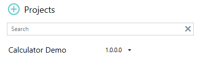
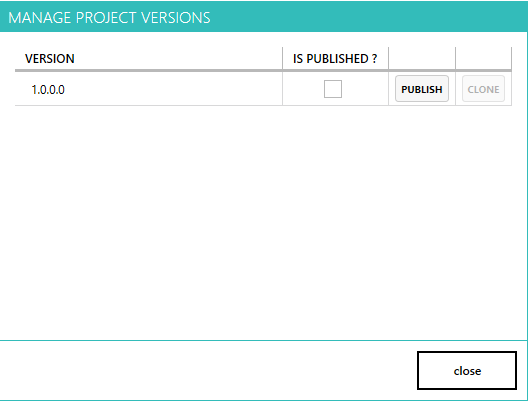
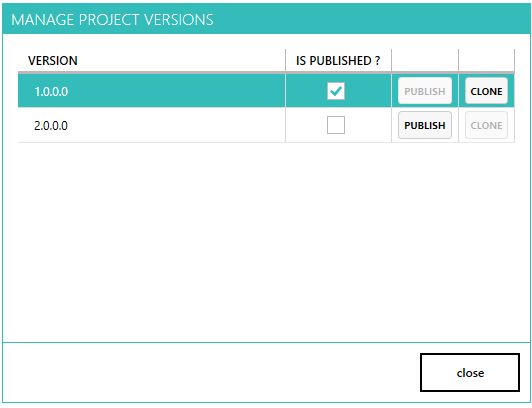

--- 
title: "Publish project"
linkTitle: "7. Publish project"
weight: 7
description: >
  Publish a given version of project.
---

In this tutorial, we will look at how can we publish a specific version of project.

Let's assume you have a software with current version 8.x in production and next upcoming version is 9.x. As the development team is working on 9.x feature, QA team will be adding automation test cases simultaneously. Eventually, 9.x version will be frozen and work will start on next version 10.x.
The QA team maintaining the automation project in pixel-designer has active version 1.x ( for 9.x of software under test). The QA team can now publish version 1.x when they think they are done with all the automation test cases for version 9.x of software. Publishing 1.x will create a cloned version 2.x. 1.x can't be opened anymore in pixel-designer. The QA team now starts working with version 2.x of automation project to add new automation test cases for changes coming in version 10.0 of software.

1. Close the automation project by clicking x on the "Calculator Demo" tab.
2. Home tab should be active now.

    

3. Hover over the project name to show hidden icons and click on the settings button next to the project name to open the version manager screen.

    

4. Click publish next to version 1.0.0.0 to publish this version and create a new incremented version 2.0.0.0. Version 2.0.0.0 will start as an exact clone of 1.0.0.0.

    

5. You can close the version manager screen now and can open the new version 2.0.0.0 to edit.