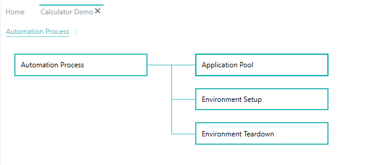
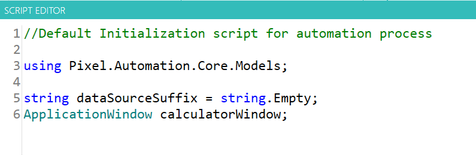
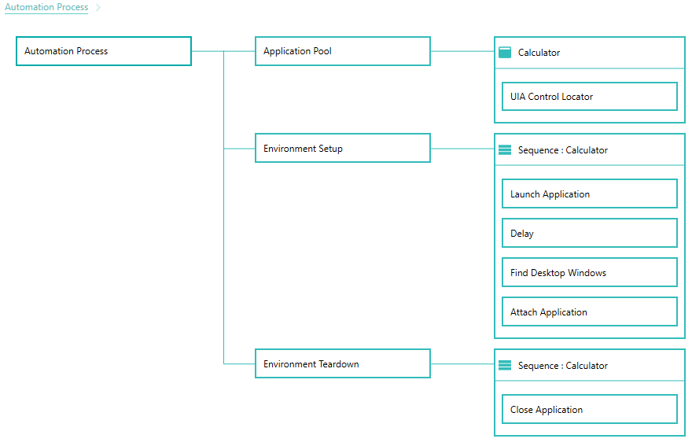

--- 
title: "Setup and Teardown"
linkTitle: "4. Setup and Teardown"
weight: 4
description: >
  Having created a new automation project, We will configure how the application to be tested is launched and closed.
---

In this tutorial, we will configure the automation process so that we can launch Calculator application as part of environment setup and close Calculator application as part of environment teardown.

1. At this point, "Calculator Demo" should be the active tab in pixel-designer.
2. Double click on the "Automation Process" component to expand it. Your designer should look shown below :

    

3. Navigate to application view by clicking the back button from control explorer view and drag drop the Calculator application on "Application Pool" component. 
This will add a "Calculator" application component and a "UIA Control Locator" child component of the "Calcultor" component. Select the "UIA Control Locator" component and change "MatchProcessId" property to false.
    >There are two window associated with Calculator. The child window has a different process Id.Hence, we need to configure to not match ProcessId while looking for controls.

4. Drag drop the application on "Environment Setup" and "Environment Teardown" components. However, this time a "Sequence : Calculator" component is added.

    > When you drag drop an application on any of the component except "Application Pool", a new component with name "Sequence:ApplicationName" is created. Application sequence components create a scope for the application. All components inside an application scope act on the target application e.g. launch component will launch application identified by the current application scope. 

    > Tip : If you are in control explorer view for a given application, you can also drag drop the empty rectangle icon from top left.

5. Open the script editor for project initialization script by clicking Project -> Edit Script from top level menu. Declare a variable calculatorWindow of type ApplicationWindow as shown and save the script. Also, add required namespace for type ApplicationWindow.

    

    > pixel-designer comes integrated with a C# code editor with rich features like intellisense and code highlighting e.g. if you hover over ApplicationWindow , you will see a yellow light bulb. You can click it and see available options that can help you to automatically add missing namespace without typing it manually.

5. Add below four components to "Environemtn Setup -> Sequence : Calculator" component from the Components pane on left. You can search for component name to filter.

    - Launch : This is required to launch the application. No configuration required.
    - Delay : This is required to add a delay between execution of next step. Select this component and set the value of "Delay Amount" to 3 in property grid.
    - Find Desktop Window : This is used to find an ApplicationWindow using different criteria e.g. title of window to find. Select this component after adding and set "Match Criteria" to "Equals", "Window Title" to "Calculator" and "TargetWindow" to "calculatorWindow" variable from dropdown that we declared earlier in property grid.   
    - Attach : This is required to attach to an existing application. Select this component and set the value of "Attach mode" to "Attach to Window" and value of "Attach To" to "calculatorWindow" variable from dropdown

    > Normally Launch will be the only component required in case of other applications like notepad. However, calc.exe spawns few other processes. Hence, we need to find the Calculator window and attach to it manually. Although, this makes tutorial a bit complicated, it also gives an idea on the flexibility offered by pixel-deigner to handle custom scenarios and a glimpse of scripting capabilities it has to offer. 

6. Add Close component to "Environemtn Teardown -> Sequence : Calculator". Close component will exit the  Calculator application that we attached to earlier during environment setup.
7. Your screen should look as shown below at this step.

    

8. Save the process from File -> Save.
9. Ensure that Calculator application is not already running.
10. Activate the "Test Explorer" pane on left and click on the Setup icon button.

    

11. Calculator application should be launched now.
12. Teardown icon button on "Test Explorer" toolbar should be enabled now. Click on it to close the application.
