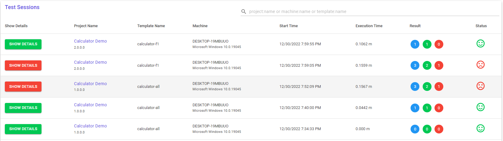
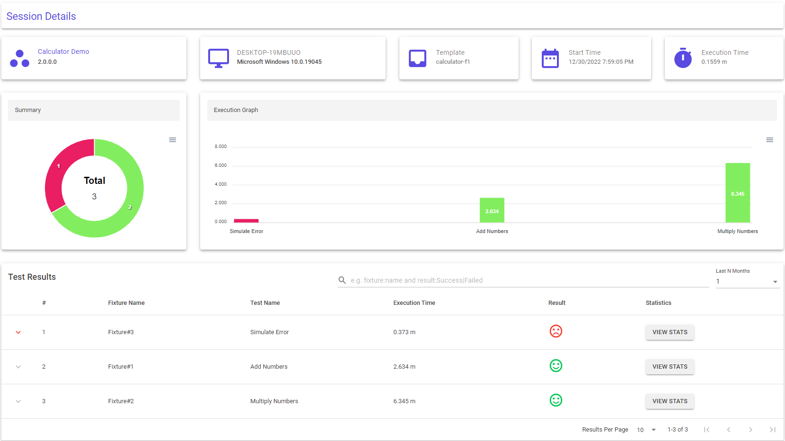
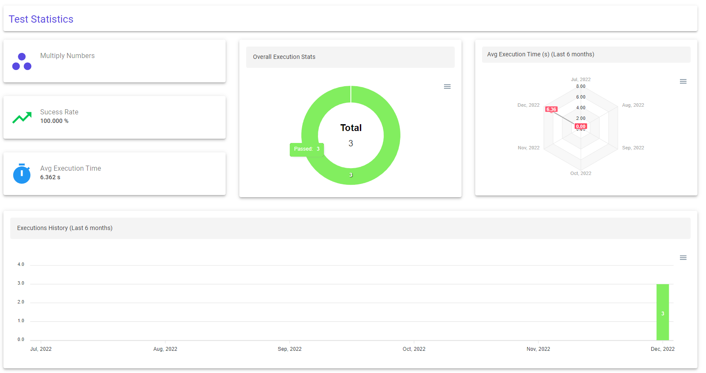

--- 
title: "View Test Results"
linkTitle: "9. View Test Results"
weight: 9
description: >
  View test results on the dashboard.
---

In this tutorial, we will see how to view the reports for test case execution on the web dashboard.

1. Navigate to (https://localhost:5001/persistence)[https://localhost:5001/persistence] on your browser of choice.

    > Depending on your deployment of pixel-persistence service, base url can be different. 

2. Click on sessions tab to see all the sessions you have executed from pixel-runner

    

3. Click "Show Details" on any session to see the details for that session.

    

4. Click "View Stats" for any of the test case to see details for that test case.

    