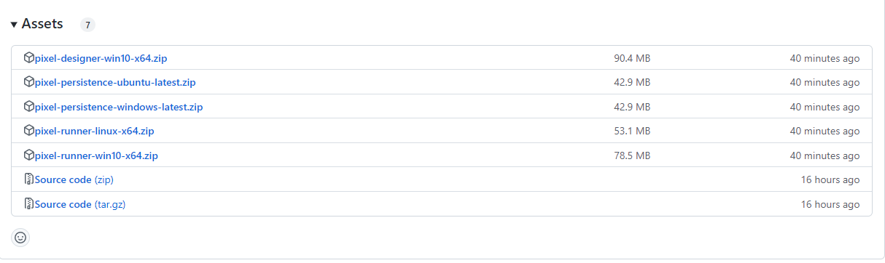
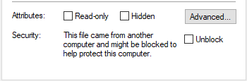

## Getting the binaries

Required binaries can be downloaded from the [releases page](https://github.com/Nfactor26/pixel-automation/releases) on project's github repository.

There are three files that you will need :
1. **pixel-designer-*.zip** - is a wpf based application and provides the design environment where you create your test cases.
2. **pixel-runner-*.zip** - is a .net core cli based application that you will use to execute your test cases on dedicated machines.
3. **pixel-persistence-*.zip** - is an asp.net core based service to store the project data and test execution results. It also provides a blazor basesd UI to view various reports from test execution.

Additionally, you will also need [mongodb](https://www.mongodb.com/try/download/community) which is required by pixel-persistence service to store all it's data.

> you must unblock the zip files by right click -> properties -> check unblock -> apply before extracting the files.

