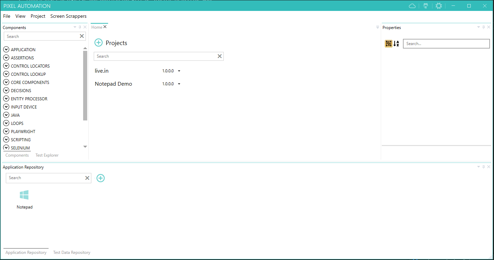
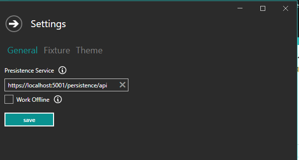
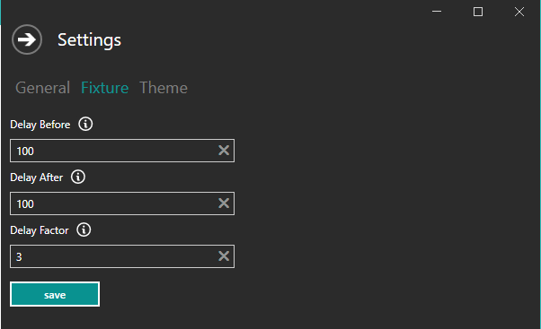
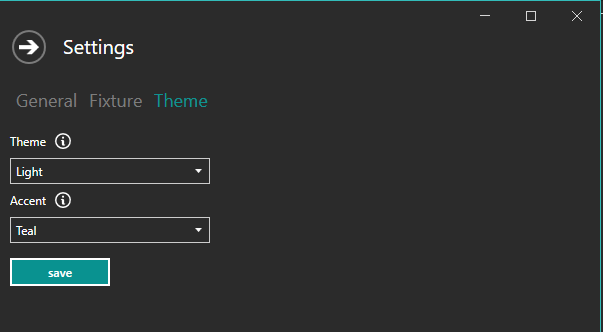

pixel-designer is a wpf based application built on top of .net core framework. It provides the design environment for creating automation test cases.
It is intended to be used on windows OS. However, it should be possible to execute the test cases designed in pixel-designer on a linux machine as well given pixel-runner can execute on both windows and linux OS. If you plan to run your test cases on linux using pixel-runner, the plugins used in a test case must be supported on linux OS.

1. Extract the files to any location after unblocking the zip files.
2. Launch pixel-design.exe and application will be started in offline mode. 
    
    > Admin rights are not required to execute the application.

    

    > pixel-designer can work in online or offline mode. Offline mode is a quick way to try out the software before going through all the required setup.

## Settings

Settings window can be opened by clicking the wheel icon on top right. There are three sections :

1. General

    

    - Persistence Service : Url of the persistence service if you want to run application in online mode.
    - Work Offline : Indicates if application should work in online or offline mode.

2. Fixture

    

    -  Delay Before : Amount of delay in milli seconds before executing each step of the automation workflow.
    -  Delay After : Amount of delay in milli seconds after executing each step of the automation workflow.
    -  Delay Factor : Delay Before and Delay After are scaled using Delay Factor before using those values. Delay Factor can be overridden by individual fixture and test cases.

3. Theme

    

    - Theme : Theme of the application. It can be light or dark.
    - Accent : Accent applied to the application. Multiple color options are available for accent.

