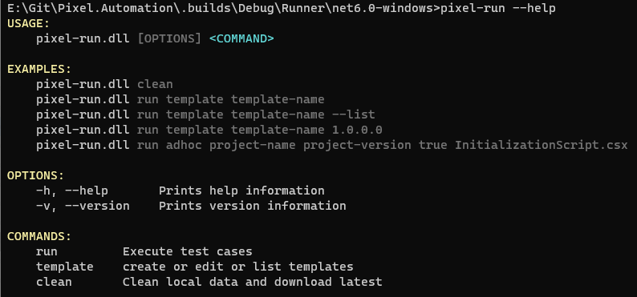

pixel-runner is a .net core cli based application that can be used to execute test cases designed in pixel-designer. It is suitable for use on your machines dedicated for execution of test cases.
Although, pixel-runner can be used on both windows and linux machines, only windows binaries are available at the moment as part of releases.

  1. Extract the files to any location after unblocking the zip files.
  2. Edit the appsettings.json and set "persistenceServiceUri" to the url of persistence-service.
  3. Launch command prompt and change working directory to the folder contaning pixel-run.exe
  4. Run pixel-run --help from the command prompt to see help menu. 

  > Admin rights are not required to execute the application

    
  